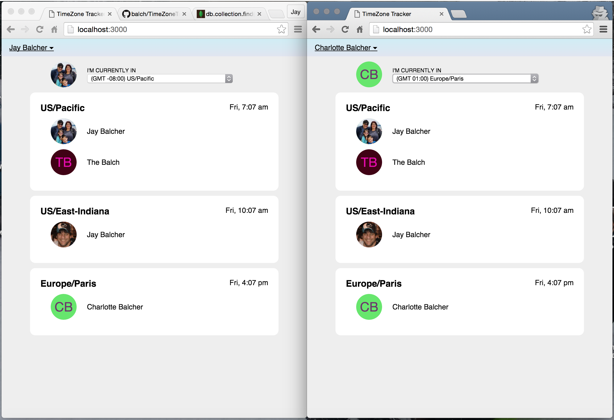
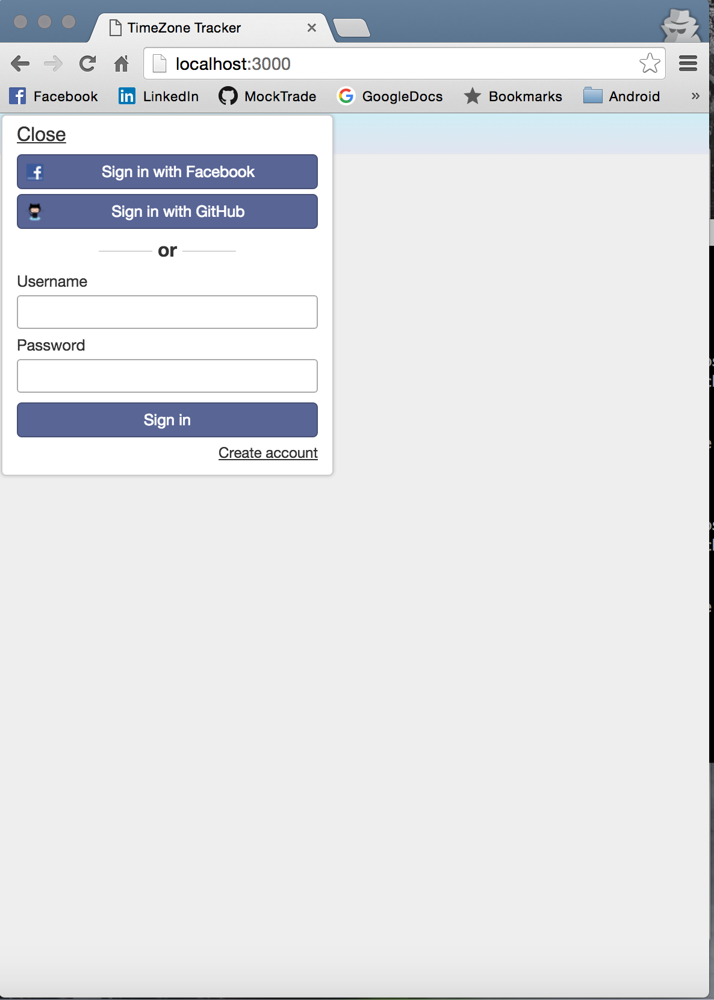

TimeZone Tracker 
===============================

* Open Source TimeZone Tracker Application
* Show all registered users by TimeZone
    * Displays Current Time in each TimeZone
    * Server Side Persistence
    * User Avatar
    * Auto updates once a minute
* Support FaceBook, GitHub, and Basic Auth
* I18n Support
* Developed with Meteor
    * My First Meteor App!!!

### Screenshots

Main Screen

Login Screen

